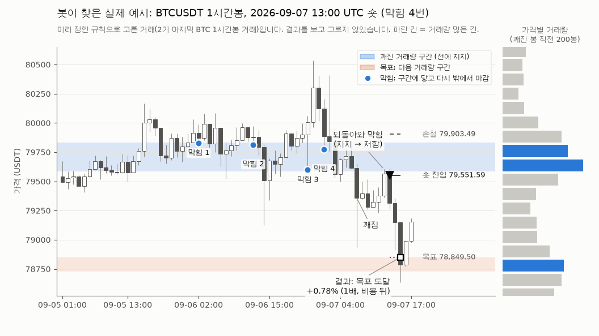

# 인스타 릴스 "매물대 지지 → 저항 전환" 매매법: 5년 자료 결과

2026-10-06 09:10~09:17 UTC에 실행했습니다(실행 6분 21초, 프로세스 2개, `nice -n 15`). 실행 전에 사전 등록 `PREREG_ZONEFLIP.md`의 sha256을 `PREREG_ZONEFLIP.sha256`에 적었습니다(`202d638e4a3d72aacc1d8ac601f9372f0ed4fdb5a923c5e8ecabadafaa642c8a`, 09:10:40 UTC). 실행 코드 `lib_zoneflip.py`(`b4a5f6d0…`)는 사전 등록 때와 같은 파일이고, 결과를 본 뒤 규칙·숫자·코드를 바꾸지 않았습니다. 버그는 발견되지 않았습니다. 그림 코드 `zf_charts.py`는 결과 뒤에 썼고 그림 배치만 다룹니다(판정 숫자와 무관).

## 판정: **실패**

**8칸(봉 4개 × 본 규칙·대조) 중 통과 0칸.** 1단계(1기)조차 통과한 칸이 없습니다. 본 규칙(MAIN, "3번 이상 막힌 구간")은 **4개 봉 모두, 세 기간 모두 비용 뒤 거래당 손실**입니다(12칸 중 12칸 마이너스). 동전 던지기(같은 손절·목표 거리, 무작위 시점)보다 나은 봉도 없습니다.

| 관문 | 통과 |
|---|---|
| 1단계 (1기) | 0 / 8 |
| 2단계·3단계 | 0 / 0 |
| BH 10% (p12, 8칸 전체) | 0 / 8 |
| 동전 던지기 BH 10% (8칸 전체) | 0 / 8 |
| 후보 / 약한 후보 / 세 기간 모두 플러스 | 0 / 0 / 0 |

## 무엇을 시험했나
릴스의 규칙을 그대로 숫자로 만들었습니다. 봉마다 **직전 200봉의 가격별 거래량**(봉의 거래량을 그 봉의 저가~고가에 고르게 나눠 50칸에 담음)을 만들고, 거래량이 많은 칸(상위 20%, 가장 많은 칸은 항상)이 붙어 있는 덩어리를 **거래량 구간**으로 봤습니다. 그 구간이 **전에 3번 이상 막아 준**(가격이 들어왔다가 원래 쪽에서 마감, 3봉 이상 간격) 뒤, 종가가 구간 반대쪽으로 **ATR의 0.25배 이상 깨지고**, **20봉 안에 되돌아와 구간에 닿았다가 다시 깬 쪽에서 마감**하면 다음 봉 시가에 진입했습니다(지지를 깨면 숏, 저항을 깨면 롱). 손절은 구간 반대쪽 끝 + 0.25 ATR, 목표는 **거래 방향의 다음 거래량 구간의 가까운 끝**, **손익비 2 미만이나 손절 3 ATR 초과는 거래 안 함**, 48봉이 지나면 청산. 바이낸스 선물 코인 6개(BTC, ETH, SOL, DOGE, LTC, BCH), 15분·30분·1시간·4시간봉, 세 기간(1기 2021-08 ~ 2024-06, 2기 2024-07 ~ 2026-09, 3기 2020-01 ~ 2021-07), 수수료·슬리피지·펀딩을 뺀 1배 기준 거래당 %입니다. **대조(CTRL)**는 "3번 막힘" 조건만 뺀 같은 규칙입니다.

## 봉 길이별 결과 (본 규칙 MAIN)
열 설명: 거래당 = 비용 뒤 1배 기준 평균 %, 비용 전 = 수수료·슬리피지·펀딩 전, 플러스 코인 = 거래 10건 이상인 코인 중 거래당 플러스인 코인 수, 동전 = 같은 코인·기간·방향·손절·목표 거리로 무작위 시점에 들어간 봇 2,000개의 거래당 평균, 계좌 = 두 분 방식 계좌(증거금 20% × 20배, 한 번에 1개)의 그 기간 최종 배수(1 = 본전).

**15분봉** (손절 거리 중앙값 0.5~0.8%, 목표 2.0~2.5%)
| 기간 | 거래 | 승률 | 평균 이익 | 평균 손실 | PF | 거래당 | 비용 전 | 플러스 코인 | 동전 | 계좌 |
|---|---|---|---|---|---|---|---|---|---|---|
| 1기 | 796 | 26.6% | +1.76% | −0.78% | 0.82 | **−0.10%** | +0.04% | 0 / 6 | −0.15% | 0.01배 |
| 2기 | 614 | 22.0% | +1.60% | −0.67% | 0.67 | **−0.17%** | −0.03% | 1 / 6 | −0.14% | 0.01배 |
| 3기 | 345 | 27.0% | +2.75% | −1.06% | 0.96 | **−0.03%** | +0.11% | 3 / 6 | −0.14% | 0.07배 |

**30분봉** (손절 0.7~1.0%, 목표 2.3~3.6%)
| 기간 | 거래 | 승률 | 평균 이익 | 평균 손실 | PF | 거래당 | 비용 전 | 플러스 코인 | 동전 | 계좌 |
|---|---|---|---|---|---|---|---|---|---|---|
| 1기 | 389 | 24.9% | +2.08% | −1.07% | 0.65 | **−0.28%** | −0.14% | 0 / 6 | −0.15% | 0.01배 |
| 2기 | 294 | 24.5% | +2.29% | −0.89% | 0.83 | **−0.11%** | +0.03% | 3 / 6 | −0.14% | 0.12배 |
| 3기 | 201 | 24.4% | +4.39% | −1.46% | 0.97 | **−0.03%** | +0.11% | 3 / 6 | −0.16% | 0.41배 |

**1시간봉** (손절 1.1~1.4%, 목표 3.9~4.6%)
| 기간 | 거래 | 승률 | 평균 이익 | 평균 손실 | PF | 거래당 | 비용 전 | 플러스 코인 | 동전 | 계좌 |
|---|---|---|---|---|---|---|---|---|---|---|
| 1기 | 180 | 24.4% | +3.64% | −1.66% | 0.71 | **−0.36%** | −0.21% | 2 / 6 | −0.16% | 0.01배 |
| 2기 | 128 | 22.7% | +3.08% | −1.34% | 0.67 | **−0.34%** | −0.18% | 1 / 6 | −0.13% | 0.16배 |
| 3기 | 100 | 21.0% | +4.78% | −1.90% | 0.67 | **−0.50%** | −0.35% | 2 / 6 | −0.16% | 0.07배 |

**4시간봉** (손절 2.5~2.7%, 목표 9~13%; 거래가 적어 숫자가 많이 흔들림)
| 기간 | 거래 | 승률 | 평균 이익 | 평균 손실 | PF | 거래당 | 비용 전 | 플러스 코인 | 동전 | 계좌 |
|---|---|---|---|---|---|---|---|---|---|---|
| 1기 | 52 | 23.1% | +9.04% | −3.73% | 0.73 | **−0.78%** | −0.57% | 2 / 2 | −0.18% | 0.07배 |
| 2기 | 48 | 22.9% | +7.09% | −2.85% | 0.74 | **−0.57%** | −0.39% | 1 / 2 | −0.12% | 0.12배 |
| 3기 | 26 | 3.8% | +14.10% | −4.61% | 0.12 | **−3.89%** | −3.69% | 0 / 0 | −0.13% | 0.05배 |

- 15분·30분봉은 **비용 전에 거의 0**(−0.14 ~ +0.11%)이고, 비용(거래당 약 0.14%, 4시간봉은 0.21%)만큼 손실입니다. 1시간·4시간봉은 비용 전부터 마이너스입니다.
- 승률이 22~27%로, 손익비 약 3(목표 거리 ÷ 손절 거리 중앙값 2.95~3.1)에서 **본전에 필요한 승률(약 25% + 비용)**을 넘지 못합니다. 목표 도달은 대부분 17~21%뿐이고 71~79%는 손절입니다(4시간봉 3기는 손절 92%). **손익비가 좋아 보이는 것은 승률이 그만큼 낮아서일 뿐**입니다.
- 1·2기를 합친 한쪽 p(우연이 아닐 확률이 높을수록 작음): 15분 1.00, 30분 1.00, 1시간 0.99, 4시간 0.88. 우위의 흔적이 없습니다.

## 동전 던지기와 비교
| 봉 | MAIN 1·2기 거래당 | 동전 1·2기 거래당 | 동전 p (작을수록 MAIN이 나음) |
|---|---|---|---|
| 15분 | −0.13% | −0.14% | 0.35 |
| 30분 | −0.21% | −0.14% | 0.86 |
| 1시간 | −0.35% | −0.15% | 0.93 |
| 4시간 | −0.68% | −0.15% | 0.83 |

15분봉만 동전과 비슷하고, 나머지는 **동전보다 나쁩니다**. "거래량 구간이 뒤집힌 순간"이라는 진입 시점이 무작위 시점보다 나은 정보를 주지 않았습니다.

## 대조 설정: "3번 막힘" 조건을 빼면
| 봉 | CTRL 거래 수 | CTRL 거래당 1기 / 2기 / 3기 | MAIN 거래당 1기 / 2기 / 3기 | MAIN − CTRL |
|---|---|---|---|---|
| 15분 | 3,791 | −0.21 / −0.14 / −0.10% | −0.10 / −0.17 / −0.03% | +0.11 / −0.03 / +0.07%p |
| 30분 | 1,821 | −0.21 / −0.08 / −0.36% | −0.28 / −0.11 / −0.03% | −0.07 / −0.03 / +0.33%p |
| 1시간 | 908 | −0.51 / −0.42 / −0.43% | −0.36 / −0.34 / −0.50% | +0.14 / +0.09 / −0.07%p |
| 4시간 | 235 | −0.23 / −0.42 / −2.09% | −0.78 / −0.57 / −3.89% | −0.55 / −0.16 / −1.80%p |

- CTRL도 **4개 봉 × 세 기간 12칸이 모두 마이너스**이고, 동전 p는 0.60~1.00입니다.
- "3번 막힘"을 요구하면 거래가 절반 이하로 줄고(6,755 → 3,173건), 거래당 평균은 전체로 −0.23% → −0.21%로 거의 같습니다. 차이의 방향도 봉·기간마다 바뀝니다(12개 중 플러스 5, 마이너스 7). **막힌 횟수는 결과를 바꾸지 못했습니다.** (판정용 검정이 아닌 설명용 비교입니다.)

## 두 분 방식 계좌
앞 연구와 같은 계좌(코인 합쳐 한 번에 1개, 증거금 20% × 20배 = 노출 4배, 4.5% 역행 시 강제 청산)로 MAIN을 돌리면, **모든 봉·모든 기간에서 계좌가 줄었습니다**(기간 끝 0.007 ~ 0.41배, 최대 낙폭 84 ~ 99.6%). 그림: `out/account_main.png`. 손절 거리 중앙값으로 본 앞 연구의 안전 여유 식으로 본 최대 레버리지는 15분 51배, 30분 40배, 1시간 28배, 4시간 13배입니다(4시간봉은 20배 기준 미달).

## 예시 그림: 봇이 찾은 실제 패턴

`out/example_setup.png` — 사전 등록에서 **미리 정한 규칙**(2기의 BTC 1시간봉 MAIN 거래 중 가장 늦은 것)으로 고른 거래입니다. 2026-09-06 02:00 ~ 09-07 01:00에 79,585 ~ 79,830 구간이 **4번 막아 주었고**, 09-07 07:00에 종가가 아래로 깨졌고, 12:00에 되돌아와 구간에 닿은 뒤 다시 아래에서 마감했습니다(지지 → 저항). 13:00 시가 79,552에 숏, 손절 79,903, 목표는 아래 거래량 구간 위 끝 78,849. 두 시간 뒤 목표에 닿아 **+0.78%**(1배, 비용 뒤)였습니다. 영상과 같은 모양을 봇이 정확히 찾는다는 것은 확인됐습니다. 다만 이것은 **이긴 거래 하나**이고, 같은 규칙의 거래 3,173건 전체는 위 표처럼 손실입니다. 영상도 금(gold) 15분봉에서 **골라 보여 준 이긴 거래 하나**이고, 이 시험은 코인 선물에서 규칙에 맞는 **모든** 거래를 셌습니다.

## 신호가 어떻게 걸러졌나 (MAIN, 세 기간·4개 봉 합계)
3번 이상 막힌 구간이 깨진 경우 88,604번 → 20봉 안에 되돌아와 다시 깬 쪽에서 마감 38,069번 → 목표 구간이 없음 20,667, 손절이 3 ATR 초과 1,207, 손익비 2 미만 12,715 → 신호 3,477번 → 보유 중이라 건너뜀 304 → **거래 3,173건.**

## 이것이 봇에 주는 의미
1. 이 매매법은 **코인 선물 5년 자료에서 비용을 넘는 우위가 없습니다.** 15분·30분봉은 비용 전 본전, 1시간·4시간봉은 비용 전부터 손실이고, 무작위로 들어가도 비슷하거나 더 낫습니다. 그래서 **봇에 이 규칙을 넣거나 paper 계좌를 만드는 것을 제안하지 않습니다.** 지금 돌고 있는 봇은 아무것도 바뀌지 않았습니다.
2. "손절은 작고 목표는 크게"는 기대값을 만들지 않습니다. 이번에도 손익비 약 3에 승률 약 24%로, 비용을 빼면 손실이었습니다.
3. "3번 막힌 구간"이라는 확인 조건도 결과를 바꾸지 못했습니다. 앞의 딥시크 시험(깨진 구간 뒤집기 F9 계열 손실)과 지지·저항 연구 A(가격대 근처라는 사실만으로는 우위 없음)와 같은 결론입니다.
4. 릴스의 차트는 이긴 거래를 고른 것입니다. 앞으로 비슷한 영상이 오면 같은 방식(규칙 고정 → 5년·세 기간 → 동전 비교)으로 확인할 수 있고, 이번처럼 실패해도 숫자를 바꿔 다시 맞추지 않습니다.

## 한계
- 시장가 매수 비중(taker buy) 자료가 우리 봉 파일에 없어 수요·공급을 **역할로만** 구분했습니다(사전 등록 5-1).
- "막힘"은 한 봉 안에서 들어갔다 나온 경우만 셌습니다. 여러 봉에 걸친 막힘은 세지 않습니다.
- 구간 지도(200봉·50칸·상위 20%), 깨짐 0.25 ATR, 되돌림 20봉, 48봉 청산은 한 값씩만 시험했습니다. 다른 값이 더 좋을 수 있지만, 결과를 보고 숫자를 바꾸면 새 사전 등록이 필요합니다.
- 4시간봉은 거래가 기간당 26~52건이라 통계 힘이 약합니다(1단계의 100건 기준 미달).
- 금(gold)이나 다른 시장, 1분·5분봉은 시험하지 않았습니다.

## 파일 (모두 `scratchpad/zoneflip/`)
- `PREREG_ZONEFLIP.md`, `PREREG_ZONEFLIP.sha256` — 사전 등록과 해시(실행 전 기록, 이후 수정 없음, 읽기 전용).
- `lib_zoneflip.py` — 규칙·자체 시험·실행(`selftest`: 손으로 만든 봉 6가지, 미래 봉 삭제·교체·섞기 시험, 동전 청산 일치, 심은 버그 6개 모두 잡힘).
- `out/results.csv`(8칸, 관문·BH·동전), `out/trades.csv.gz`(9,928건), `out/counts.csv`(신호 단계별 수), `out/by_coin.csv`, `out/by_year.csv`, `out/by_side.csv`, `out/flips.npz`(봇 2,000개 합계), `out/summary.json`, `out/data_manifest.json`(봉 파일 sha256).
- 그림: `out/example_setup.png`, `out/account_main.png` (`zf_charts.py`), 예시 거래 상세 `out/example_trade.json`.
- 거래 총수 9,928건(MAIN 3,173, CTRL 6,755).
